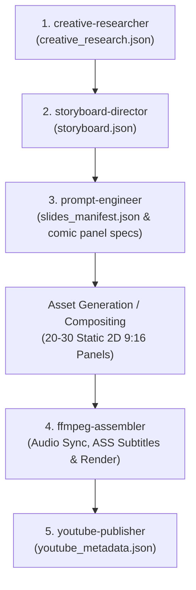

# Generation Workflow Rule: The Comic-Sync Lifecycle

## The 5-Stage Agent Chain & JSON Contract Protocol
All productions strictly follow this sequential 5-stage lifecycle in English:

### Directorial Ground Rules:
1. **Format:** 9:16 Vertical (1080x1920) for YouTube Shorts.
2. **Language:** English only.
3. **No Video Diffusion Morphing:** Visuals are 100% static 2D full-color comic panels with zero character rigging or lip-sync.
4. **Semantic Cut Alignment:** Cuts hit on the exact word/clause boundaries from the audio track.
5. **Agent Handoff Requirement:**
   - Once an agent finishes its designated JSON contract, it signals `[TASK_COMPLETE]` and recommends proceeding to the next responsible agent.
