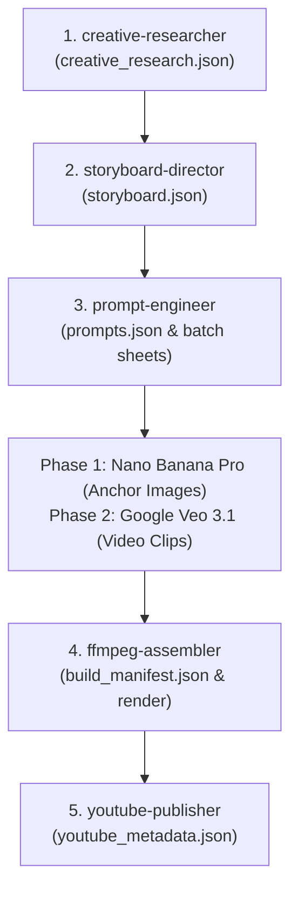

# Generation Workflow Rule

## The Agent Chain & JSON Contract Protocol
All Stickman & Ink Explainer productions strictly follow this sequential 5-stage lifecycle. Each agent completes its scope of work, writes its designated JSON contract, outputs `[TASK_COMPLETE]`, and recommends the next responsible agent:

### Directorial Ground Rules:
1. **Nano Banana Pro (Imagen 3)** is the ONLY image generation tool for scene anchors.
2. **Google Veo 3.1** in Google Flow / VideoFX is the ONLY tool for video clips (Image-to-Video).
3. **Phase Separation**:
   - Provide the exact prompt text for **Phase 1: Nano Banana Pro** anchor images FIRST.
   - Wait for user generation / confirmation before moving to **Phase 2: Google Veo 3.1**.
4. **Agent Handoff Requirement**:
   - Once an agent finishes its JSON contract, it must signal `[TASK_COMPLETE]` and explicitly recommend proceeding to the next responsible agent.
