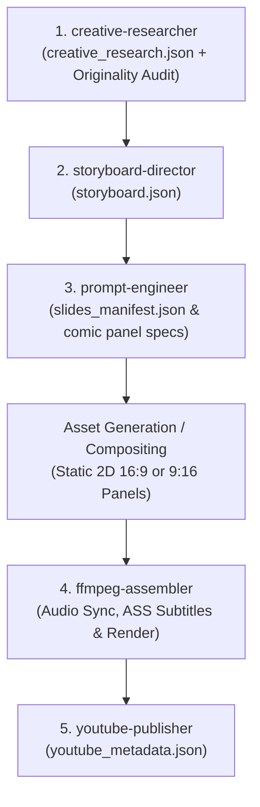

# Generation Workflow Rule: The Comic-Sync Lifecycle

## The 5-Stage Agent Chain & JSON Contract Protocol
All productions strictly follow this sequential 5-stage lifecycle in English:

### Directorial Ground Rules:
1. **Mandatory Stage 1 Research Gate (Never Skip):**
   - Stage 1 is non-negotiable. No project may advance to scripting or storyboarding without an approved `creative_research.json` containing an explicit `originality_audit`.
   - YouTube strictly penalizes duplicate/reused content; every video must present a novel thesis, empirical psychological grounding, and proprietary metaphors.
2. **Formats Supported:**
   - **Long-Form Explainer Series:** 16:9 Widescreen (1920x1080) multi-chapter deep dives.
   - **Shorts:** 9:16 Vertical (1080x1920) high-APV psychological narratives.
3. **Language:** English only.
4. **No Video Diffusion Morphing:** Visuals are 100% static 2D full-color hand-drawn ink panels with zero character rigging or lip-sync.
5. **100% Semantic Cut Alignment:** Cuts hit on the exact word/clause boundaries from the audio track, strictly avoiding the Sentence Boundary Trap.
6. **Agent Handoff Requirement:**
   - Once an agent finishes its designated JSON contract, it signals `[TASK_COMPLETE]` and recommends proceeding to the next responsible agent.
7. **Iterative Visual Review & Re-roll Standard (Perfection Gate):**
   - For every shot, generate 3–4 distinct visual candidates in `slide_temp/`.
   - The director/agent performs a rigorous audit checking narrative metaphor, mobile contrast, and style consistency.
   - **Zero Compromise Rule:** Never settle for a mediocre or slightly flawed visual. If none of the candidates achieve 100% narrative alignment and visual punch, discard and generate fresh variants until a truly perfect visual is found.
   - Once a candidate is approved, promote it to `slides/slide_XXX.jpg`, purge non-selected temp files, and advance.
8. **Narrative Persona & Setting Standard:**
   - Every script strictly enforces the *Elder Brother / Senior Classmate* relatable human voice, mandatory *Intro Question Hook* (4–7s for Shorts, 10–15s for Long-Form), and strictly bans the word `hallway` in favor of concrete world anchors (*college hall, classroom, library, friend's home, neighborhood*). See [.agents/rules/narrative_persona_and_hook_rule.md](file:///f:/Arnav%20-%20YT/stickman-video-director/.agents/rules/narrative_persona_and_hook_rule.md).

