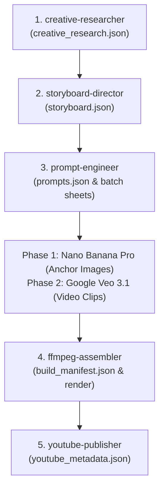

# Studio Target Output Specification: The Paint Explainer / Ink Explainer Standard

> **MANDATE:** This document defines the exact, non-negotiable benchmark for all visual, audio, consistency, and pacing outputs produced by this studio. Every agent, prompt, script, and render must conform 100% to this specification.

---

## 1. Executive Channel Archetype
* **Reference Channels:** *The Paint Explainer*, *Ink Explainer*, *Casually Explained*.
* **Niche:** Dark Psychology, Behavioral Economics, Student & Campus Dynamics, Stoic Frame Control, Cognitive Biases.
* **Target Audience:** High school, college, and university students, curious thinkers, young adults.
* **Video Format:** 9:16 Vertical (1080x1920) YouTube Shorts / TikTok / Instagram Reels.
* **Duration:** 45 to 55 seconds (6 to 7 eight-second Veo 3.1 shots).
* **Target Metric:** >85% Average Percentage Viewed (APV) via high retention and visual engagement.

---

## 2. Visual Specification (The "Ink Explainer" DNA)

### 2.1 The Canvas & Palette
* **Canvas Texture:** Crisp, warm off-white textured paper (`#FAF9F6` or `#F4F3EE`).  
  * ❌ *Never use pure digital `#000000` or sterile blinding white `#FFFFFF`.*
* **Primary Ink:** Deep solid black ink pen strokes (`#0A0D14`), uniform 6px–8px vector weight.
* **The 1-Color Accent Rule:** 95% of every scene is strictly monochrome. At most **ONE** accent color is permitted per scene:
  * **Crimson Red (`#FF2A4D`):** Represents ego, emotional vulnerability, toxic traps, rage, social anxiety.
  * **Electric Cyan (`#00F0FF`):** Represents stoic frame control, truth, cognitive clarity, emotional detachment, quiet authority.
  * ❌ *Never mix 3+ colors or use multi-color gradients.*

### 2.2 Character Anatomy & Rules
* **Head:** Perfectly smooth circular white shape (`#FFFFFF`) with a clean, crisp solid black outline.
* **Facial Features:** Minimalist doodle expressions only (simple dot eyes, angled eyebrow strokes, or neutral blinks).  
  * ❌ *Never render realistic human skin, pupils, nostrils, or realistic mouths.*
* **Limbs & Torso:** Clean 2D black line strokes (6px-8px). Joints are fluid and stylized.
* **Physical Weight & Grounding:** Characters stand firmly on an invisible ground baseline. Postures communicate psychological states (shrugging, hands on chin, crossed arms, slumping under weight).

### 2.3 Visual Metaphors & Props
* Every abstract psychological concept must be translated into a hand-drawn black ink doodle prop:
  * *Ego/Insecurity:* Megaphones, heavy boulders, puppet strings, padlocks.
  * *Emotional Detachment:* Invisible forcefields, glowing concentric cyan magnetic rings, balance scales.
  * *Student Reality:* Lecture desks, coffee cups, spiral notebooks, cafeterias, backpacks, lockers.

### 2.4 Framing & Safe Zones (1080x1920)
* **Vertical Safe Zone:** All critical visual action and characters must be positioned between **Y: 300px and Y: 1400px**.
* Top 300px: Reserved for Shorts search and header.
* Bottom 500px: Reserved for YouTube Shorts title, channel icon, sound button, and kinetic subtitles.

---

## 3. Audio Specification (Broadcast Standard)

### 3.1 Voiceover Narration
* **Voice Profile:** Deep, resonant, authoritative, articulate male narrator (`en-US-ChristopherNeural` via Edge-TTS or studio recording).
* **Pacing & Cadence:** 140 to 155 words per minute. Confident, unhurried, with **0.3s breathing pauses** between logical beats to let concepts sink in.
* **Word Boundary Timestamps:** Sub-second millisecond accuracy for every word to drive kinetic karaoke subtitle highlighting.

### 3.2 Sound Design & Foley (3-Track Native Sound)
1. **Dialogue Track:** Clean, dry voiceover centered in the stereo field.
2. **Background Music (BGM):** Contemplative lo-fi, ambient dark piano, or subtle psychological drone (`assets/bgm/`).  
   * **Sidechain Compression:** BGM is automatically ducked by **-12dB** whenever the narrator speaks.
3. **Tactile Foley & SFX:** Physical sound effects anchored to visual micro-actions:
   * `pencil_scratch.mp3`: On notes being written or diagrams appearing.
   * `coffee_sip.mp3`: On subtle unbothered character moments.
   * `paper_rustle.mp3`: On book/calendar page turns.
   * `bass_drop_thud.mp3` & `rubber_stamp.mp3`: On philosophical climax punchlines.

### 3.3 Mastering Standards
* **Integrated Loudness:** Strictly normalized to **-14 LUFS** standard (`loudnorm=I=-14:LRA=7:tp=-1`).
* **Audio Format:** 44.1 kHz, 192 kbps AAC stereo.

---

## 4. Consistency & Anti-Hallucination Protocol (100% Locked Standard)

### 4.1 Two-Stage Generation Workflow
* **Stage 1: Scene Anchor Images (Nano Banana Pro / Imagen 3):**
  * Generates high-contrast 2D line art frames with locked Character DNA in 9:16 vertical.
  * Establishes pixel-accurate starting positions for characters, props, and background paper texture.
* **Stage 2: Video Motion Clips (Google Veo 3.1):**
  * Operates exclusively via **Image-to-Video (I2V)** in Google Flow / VideoFX using the approved anchor image as the starting frame.

### 4.2 Eliminating Veo 3.1 Hallucinations (The Zero-Drift Rules)
1. **Tightly Squeezed 1s–1.5s Micro-Intervals:**
   * ❌ *Never use broad time gaps like `0s-4s` or `4s-8s`.* In diffusion transformers, latent entropy begins around Frame 40 (~1.5s) without guidance, causing limb morphing and character duplication.
   * ✅ *Structure every 8-second clip into continuous micro-intervals:*  
     `0s-1s` $\to$ `1s-2.5s` $\to$ `2.5s-4s` $\to$ `4s-5.5s` $\to$ `5.5s-7s` $\to$ `7s-8s`.
2. **Low Latent Displacement (Micro-Motions Only):**
   * Avoid large wild locomotion (running across room, full-body flips) which forces Veo into 3D photorealistic priors.
   * Use subtle, controlled 2D micro-actions: raising an arm, nodding, tilting head, taking a sip, tapping a pen, pointing, eyes blinking.
3. **Anchor Fidelity & Spatial Respect:**
   * Never describe a character "entering frame" if they already exist in the starting image.
   * Never describe characters at coordinates that contradict the starting anchor.
4. **Mandatory Anti-Hallucination Guardrail:**
   * Every single Veo 3.1 prompt MUST conclude with:
     ```text
     Only the characters already present in the starting frame animate. No new characters appear anywhere in the frame.
     ```
5. **Camera Stability:**
   * Use fixed/static camera holding or gentle 1.05x linear push-in.
   * ❌ *Never use fast whip pans, 3D orbits, or barrel rolls.*

---

## 5. Kinetic Subtitles Specification

* **Subtitle Format:** Advanced SubStation Alpha (`.ass`), burned directly into video via FFmpeg `ass` filter.
* **Font Family:** `Arial Black` or `Montserrat ExtraBold`, ALL UPPERCASE.
* **Font Size & Safe Margins:**
  * Resolution: `1080x1920` (PlayResX: 1080, PlayResY: 1920)
  * Font Size: `56px`
  * Vertical Margin (`MarginV`): `440px` (Ensures captions sit cleanly above YouTube Shorts title/channel overlays).
* **Karaoke Active-Word Color Styling:**
  * **Active Spoken Word:** Vivid Glowing Gold/Amber (`&H0000D7FF`) with subtle 108% scale pop.
  * **Inactive Words:** Crisp Solid White (`&H00FFFFFF`).
  * **Outline Border:** Deep Charcoal/Black (`&H000A0D14`), `4.5px` border thickness with subtle drop shadow.
  * *Result: 100% legible over light paper backgrounds, dark scenes, or colorful props.*
* **Pacing:** Short 2-to-3 word chunks displayed at a time for maximum kinetic reading velocity.

---

## 6. Narrative Architecture & Student Relatability

### 6.1 The 3-Second Hook Rule
* The first shot must immediately state a counter-intuitive paradox or challenge a universal social assumption.
* ❌ *No generic intros, no "Welcome back", no "In this video we will discuss..."*
* ✅ *Direct psychological hook: "In psychology, the Alpha needs the hierarchy. Without applause, he is nothing."*

### 6.2 Campus & Student Grounding
* Explanations must be anchored in visceral, everyday high school and college experiences:
  1. **Group Projects:** Who talks loud vs who actually does the work.
  2. **The Canteen:** Entourage dependency vs being completely comfortable eating lunch alone.
  3. **Classroom Teasing:** Fragile ego explosions vs unbothered stoic cold stares.
  4. **Campus Dating:** Desperate peacocking vs natural magnetic detachment.
  5. **Graduation Reality:** Exhausted validation burnout vs quiet real-world competence.

---

## 7. Multi-Agent Pipeline & JSON Contract Protocols

All productions are executed sequentially by specialized agents communicating strictly through JSON contracts:



| Agent | Responsibility | JSON Contract Output |
| :--- | :--- | :--- |
| **`creative-researcher`** | Brainstorms psychological thesis, student relatability, and narrative arc. | `creative_research.json` |
| **`storyboard-director`** | Breaks narrative into 6–7 eight-second shots with camera, action, and audio cues. | `storyboard.json` |
| **`prompt-engineer`** | Generates Nano Banana Pro anchors and Veo 3.1 zero-gap micro-motion prompts. | `prompts.json`, `quick_batch_copypaste.txt` |
| **`ffmpeg-assembler`** | Ingests clips, combines voiceover, ducks BGM, burns ASS subtitles, renders MP4. | `build_manifest.json`, `ep_final.mp4` |
| **`youtube-publisher`** | Formulates high-CTR titles, curiosity-gap description, psychology tags, and hashtags. | `youtube_metadata.json` |
