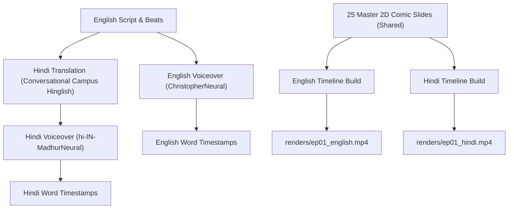

# Dual-Language Production Architecture (English + Hindi Pipeline)

> **PURPOSE:** Generate a 1:1 Hindi instance (`_hindi.mp4`) from every completed English production with zero visual redesign, doubling channel output and monetization speed.

---

## 1. Why the Comic-Sync Architecture Makes Hindi Trivial

In traditional video generation (Veo 3.1 / Kling), dubbing into Hindi causes terrible desynchronization because lip movements and scene timings are locked to English speech.

In the **Ink Explainer 2D Static Panel** model:
1. **Characters Have No Lip-Sync:** Stickmen communicate emotion through posture, eyebrow angles, and props—not mouth movements.
2. **Visuals are Language-Agnostic:** A stickman backbencher smirking in a lecture hall means the exact same thing in English and Hindi.
3. **Dynamic Slide Re-Timing:** Since each slide is a static image, the timeline automatically stretches or compresses to match the Hindi voice cadence down to the millisecond.

---

## 2. The English-to-Hindi Pipeline Lifecycle

---

## 3. Hindi Voiceover Profile & Tooling

* **Engine:** Local Microsoft Edge-TTS (`edge-tts`).
* **Voice Model:** `hi-IN-MadhurNeural`
  * Deep, calm, articulate Indian male narrator.
  * Natural conversational cadence matching top Indian explainer creators.
* **Volume & Mastering:** Same -11.9 LUFS integrated standard via FFmpeg `loudnorm`.

---

## 4. Scripting for Indian College / Campus Relatability

Instead of formal bookish Hindi, the script translates into **Colloquial Hinglish / Conversational Campus Hindi**:

| English Original | Natural Indian Campus Hindi (Spoken VO) |
| :--- | :--- |
| *"In every college lecture hall, there is one guy in the back row who never raises his hand."* | *"College ke har lecture hall mein... ek ladka hamesha back row mein hota hai jo kabhi haath nahi uthata."* |
| *"He doesn't fight for attention. He doesn't laugh at bad jokes."* | *"Na use attention chahiye, na wo zabardasti ke jokes par hasta hai."* |
| *"Yet, girls constantly wonder what he is thinking."* | *"Lekin fir bhi, poori class ka dhyan usi par rehta hai."* |

---

## 5. Subtitle Strategy for Hindi Shorts

Viewers in India have massive retention for **Hinglish Karaoke Subtitles** (Hindi spoken words written in English/Latin alphabet with gold active highlights):
* Font: `Montserrat ExtraBold` or `Arial Black`
* Active Spoken Word: Radiant Gold (`&H0000D7FF`)
* Inactive Words: Solid White (`&H00FFFFFF`)
* Safe Zone: `MarginV: 400`
