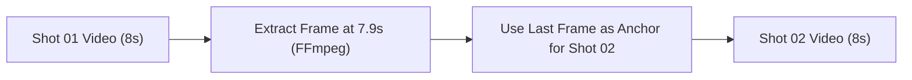

# Chapter 03: Image-to-Video & The Last-Frame Technique

> "Text-to-Video creates random beautiful chaos. Image-to-Video creates controllable cinematic continuity."

While Text-to-Video (T2V) is impressive for single b-roll shots, **it is practically impossible to maintain episodic character consistency across multiple cuts with T2V alone**. The secret used by leading AI animation studios is an **Image-First (I2V)** workflow.

---

## 1. Why Image-to-Video (I2V) is Non-Negotiable

| Capability | Text-to-Video (T2V) | Image-to-Video (I2V) |
| :--- | :--- | :--- |
| **Character Face Consistency** | ❌ Drifts every shot; eyes, hair, skin tone mutate. | ✅ 100% locked to the starting anchor image. |
| **Wardrobe & Props** | ❌ Shirt graphics, shoe colors, and accessories change. | ✅ Retains exact clothing, logos, colors, and textures. |
| **Spatial Environment** | ❌ Ground, architecture, and lighting shift randomly. | ✅ Pixel-accurate continuity with previous scene. |
| **Credit Efficiency** | ❌ High failure rate; requires multiple re-rolls. | ✅ Predictable, high first-shot success rate. |

---

## 2. The Anchor Rules (Preventing Character Duplication)

In diffusion Image-to-Video models, **the starting image is ground truth**. If your text prompt contradicts what is already visible in the starting image, the model will hallucinate duplicate characters or tear pixels.

### Cardinal Rule 1: Never Describe Characters "Entering" if Already Visible
* ❌ **Faulty Prompt:** Starting with an image where Emily is already standing outside the cave, and writing: *"Emily steps out from behind the trees into view."*
  * **Result:** Veo sees Emily already standing there, assumes the prompt is requesting a *second* girl to step out, and generates **two Emilys**!
* ✅ **Correct Prompt:** *"The existing Emily already standing outside the cave gently clasps her hands together and sighs with sympathy."*

### Cardinal Rule 2: Respect Starting Depth & Coordinates
* If your characters are in the background on top of a hill, **never** say: *"In the foreground, the kids..."*
* Always reference their exact anchor position: *"Up on the hill at the top-right behind the pine tree, the existing Tommy and Emily peek around the trunk..."*

### Cardinal Rule 3: The Anti-Hallucination Guardrail
Always append this explicit directive at the end of the `[Visual Motion]` block:
```text
Only the characters already present in the starting frame animate. No new characters appear anywhere in the frame.
```

---

## 3. The "Last-Frame Technique" (Continuous Chaining)

When animating a continuous, unbroken sequence (e.g. an action chase, an argument, or a ball pass across two consecutive shots), top studios use **Last-Frame Chaining**:



### How to Extract the Exact Last Frame with FFmpeg:
Run this single command on your completed clip:
```bash
ffmpeg -sseof -0.1 -i clip_01.mp4 -update 1 -q:v 1 shot_02_anchor.jpg
```
* **Why this works:** The starting frame of Shot 02 is mathematically identical to the ending frame of Shot 01. Lighting, character poses, clothing folds, and environmental geometry are 100% continuous.
* **When to use:** Whenever the camera does a continuous push, a match cut, or an immediate scene extension.
